# DevSecOps Pipeline (GitHub-Native)

[](https://opensource.org/licenses/MIT)
[](https://github.com/features/actions)
[](https://aws.amazon.com/)
[](https://www.docker.com/)
[](https://kubernetes.io/)
[](#security-tools)

A comprehensive GitHub-native DevSecOps pipeline with integrated security scanning, automated builds, and Kubernetes deployment. This pipeline implements security-first practices with multiple scanning stages and clean, maintainable automation.

## 🛡️ Security-First Pipeline

### Pipeline Stages Overview


## 🔧 Pipeline Stages

### 1. 🔍 **Secrets Scanning** - Gitleaks
- **Purpose**: Detect hardcoded secrets, API keys, and credentials
- **Tool**: [Gitleaks](https://github.com/zricethezav/gitleaks)
- **Scope**: Scans entire git history and current commit
- **Fail Condition**: Any secrets detected

```yaml
# Example Gitleaks configuration
- name: Run Gitleaks
  uses: gitleaks/gitleaks-action@v2
  env:
    GITHUB_TOKEN: ${{ secrets.GITHUB_TOKEN }}
```

### 2. 🔒 **Static Application Security Testing (SAST)** - CodeQL
- **Purpose**: Identify security vulnerabilities in source code
- **Tool**: [GitHub CodeQL](https://codeql.github.com/)
- **Languages**: JavaScript, Python, Java, C#, C++, Go, Ruby
- **Analysis**: Data flow analysis, control flow analysis

```yaml
# CodeQL Analysis
- name: Initialize CodeQL
  uses: github/codeql-action/init@v2
  with:
    languages: javascript, python
```

### 3. 🏗️ **Build & Container Registry** - Docker → GHCR
- **Purpose**: Build optimized container images
- **Registry**: GitHub Container Registry (GHCR)
- **Features**: Multi-stage builds, layer caching, vulnerability scanning
- **Tagging**: Semantic versioning with git SHA

```dockerfile
# Multi-stage optimized build
FROM node:18-alpine AS builder
WORKDIR /app
COPY package*.json ./
RUN npm ci --only=production

FROM node:18-alpine AS runtime
COPY --from=builder /app .
EXPOSE 3000
CMD ["npm", "start"]
```

### 4. 🐳 **Container Image Scanning** - Trivy
- **Purpose**: Scan container images for vulnerabilities
- **Tool**: [Trivy](https://github.com/aquasecurity/trivy)
- **Scans**: OS packages, application dependencies, misconfigurations
- **Output**: SARIF format for GitHub Security tab integration

```yaml
# Container scanning with Trivy
- name: Run Trivy vulnerability scanner
  uses: aquasecurity/trivy-action@master
  with:
    image-ref: 'ghcr.io/${{ github.repository }}:${{ github.sha }}'
    format: 'sarif'
    output: 'trivy-results.sarif'
```

### 5. 📋 **Infrastructure as Code (IaC) Security** - Checkov
- **Purpose**: Scan Terraform and Kubernetes manifests for misconfigurations
- **Tool**: [Checkov](https://www.checkov.io/)
- **Coverage**: AWS, Azure, GCP, Kubernetes, Docker
- **Policies**: CIS benchmarks, security best practices

```yaml
# IaC security scanning
- name: Run Checkov action
  uses: bridgecrewio/checkov-action@master
  with:
    directory: .
    framework: terraform,kubernetes
```

### 6. 📦 **Software Bill of Materials (SBOM)** - Syft + Grype
- **Purpose**: Generate SBOM and scan for known vulnerabilities
- **Tools**: [Syft](https://github.com/anchore/syft) for SBOM generation, [Grype](https://github.com/anchore/grype) for vulnerability scanning
- **Formats**: SPDX, CycloneDX, JSON
- **Database**: CVE, GitHub Advisory Database

```yaml
# SBOM generation and vulnerability assessment
- name: Generate SBOM
  uses: anchore/sbom-action@v0
  with:
    image: ghcr.io/${{ github.repository }}:${{ github.sha }}
    format: spdx-json
```

### 7. 🚀 **Deployment** - Kubernetes
- **Target**: Development environment
- **Method**: kubectl with kubeconfig secret
- **Features**: Rolling updates, health checks, resource limits
- **Rollback**: Automatic rollback on deployment failure

## 🏗️ Architecture

### Pipeline Flow Architecture

```mermaid
graph LR
    A[📝 Code Commit] --> B[🔍 Secrets Scan<br/>Gitleaks]
    B --> C[🔒 SAST Analysis<br/>CodeQL]
    C --> D[🏗️ Build & Push<br/>Docker → GHCR]
    D --> E[🐳 Container Scan<br/>Trivy]
    E --> F[📋 IaC Security<br/>Checkov]
    F --> G[📦 SBOM Generation<br/>Syft + Grype]
    G --> H[🚀 Deploy to Dev<br/>kubectl]
    
    style B fill:#ff6b6b
    style C fill:#ff6b6b
    style E fill:#ff6b6b
    style F fill:#ff6b6b
    style G fill:#ff6b6b
```


### Infrastructure Architecture

```mermaid
graph TB
    subgraph "Developer Workstation"
        DevLocal[👨‍💻 Developer]
        GitLocal[📁 Local Git Repo]
        IDE[💻 VS Code / IDE]
    end
    
    subgraph "GitHub Cloud Platform"
        subgraph "GitHub Repository"
            CodeRepo[📝 Source Code Repository]
            Secrets[🔐 GitHub Secrets]
            PRs[🔄 Pull Requests]
        end
        
        subgraph "GitHub Actions (CI/CD)"
            ActionsRunner[🏃‍♂️ GitHub Runners]
            WorkflowEngine[⚙️ Workflow Engine]
            SecurityScanning[🛡️ Security Scanning Suite]
        end
        
        subgraph "GitHub Registry"
            GHCR[📦 GitHub Container Registry]
            Packages[📚 Package Registry]
            Artifacts[📋 Build Artifacts]
        end
        
        subgraph "Security & Monitoring"
            SecurityTab[🔒 Security Dashboard]
            DependencyGraph[🕸️ Dependency Graph]
            VulnAlerts[⚠️ Vulnerability Alerts]
        end
    end
    
    subgraph "AWS Cloud Infrastructure"
        subgraph "Network Layer"
            VPC[🌐 Virtual Private Cloud<br/>10.0.0.0/16]
            PublicSubnet[🌍 Public Subnets<br/>Multi-AZ]
            PrivateSubnet[🔒 Private Subnets<br/>Multi-AZ]
            IGW[🚪 Internet Gateway]
            NATGW[🔄 NAT Gateway]
        end
        
        subgraph "Compute Layer"
            EKS[☸️ Amazon EKS Cluster<br/>Managed Kubernetes]
            NodeGroup1[💻 System Node Group<br/>t3.medium]
            NodeGroup2[⚡ App Node Group<br/>t3.large]
            Fargate[🚀 Fargate Profiles<br/>Serverless Pods]
        end
        
        subgraph "Application Layer"
            DevNamespace[🧪 Development Namespace]
            StagingNamespace[🧪 Staging Namespace]
            ProdNamespace[🏭 Production Namespace]
            DemoApp[📱 Demo Application Pods]
        end
        
        subgraph "Storage & Database"
            EFS[📁 Amazon EFS<br/>Shared Storage]
            EBS[💾 Amazon EBS<br/>Block Storage]
            ECR[📦 Amazon ECR<br/>Backup Registry]
        end
        
        subgraph "Security & Monitoring"
            GuardDuty[🛡️ GuardDuty<br/>Threat Detection]
            CloudTrail[📊 CloudTrail<br/>Audit Logging]
            CloudWatch[📈 CloudWatch<br/>Monitoring & Alerts]
            SecretsManager[🔐 Secrets Manager<br/>Runtime Secrets]
        end
        
        subgraph "Load Balancing"
            ALB[⚖️ Application Load Balancer]
            NLB[🔗 Network Load Balancer]
            Route53[🌐 Route 53<br/>DNS Management]
        end
    end
    
    subgraph "External Services"
        Users[👥 End Users]
        Monitoring[📊 External Monitoring<br/>Datadog/New Relic]
        SIEM[🔍 SIEM Integration<br/>Splunk/ELK]
    end
    
    %% Developer Flow
    DevLocal --> GitLocal
    GitLocal --> CodeRepo
    IDE --> CodeRepo
    
    %% CI/CD Flow
    CodeRepo --> ActionsRunner
    Secrets --> ActionsRunner
    ActionsRunner --> SecurityScanning
    ActionsRunner --> GHCR
    ActionsRunner --> EKS
    
    %% Security Reporting
    SecurityScanning --> SecurityTab
    SecurityScanning --> VulnAlerts
    SecurityScanning --> DependencyGraph
    
    %% Deployment Flow
    GHCR --> EKS
    EKS --> DemoApp
    DemoApp --> DevNamespace
    DemoApp --> StagingNamespace
    
    %% Infrastructure Dependencies
    EKS --> NodeGroup1
    EKS --> NodeGroup2
    EKS --> Fargate
    EKS --> EFS
    EKS --> EBS
    EKS --> SecretsManager
    
    %% Network Flow
    Users --> Route53
    Route53 --> ALB
    ALB --> EKS
    IGW --> PublicSubnet
    NATGW --> PrivateSubnet
    VPC --> EKS
    
    %% Monitoring Flow
    EKS --> CloudWatch
    EKS --> CloudTrail
    EKS --> GuardDuty
    CloudWatch --> Monitoring
    CloudTrail --> SIEM
    
    %% Styling
    classDef github fill:#24292e,stroke:#fff,stroke-width:2px,color:#fff
    classDef aws fill:#FF9900,stroke:#fff,stroke-width:2px,color:#fff
    classDef security fill:#dc3545,stroke:#fff,stroke-width:2px,color:#fff
    classDef compute fill:#28a745,stroke:#fff,stroke-width:2px,color:#fff
    classDef storage fill:#fd7e14,stroke:#fff,stroke-width:2px,color:#fff
    classDef network fill:#6f42c1,stroke:#fff,stroke-width:2px,color:#fff
    classDef users fill:#17a2b8,stroke:#fff,stroke-width:2px,color:#fff
    
    class CodeRepo,ActionsRunner,GHCR,SecurityTab github
    class VPC,EKS,ALB,Route53,CloudWatch aws
    class GuardDuty,SecurityScanning,SecretsManager security
    class NodeGroup1,NodeGroup2,Fargate,DemoApp compute
    class EFS,EBS,ECR storage
    class PublicSubnet,PrivateSubnet,IGW,NATGW network
    class Users,DevLocal,Monitoring,SIEM users
```


## 🚀 Quick Start

### 1. Repository Setup
```bash
# Clone the repository
git clone https://github.com/sat0ps/DevSecOps-Pipeline-github.git
cd DevSecOps-Pipeline-github

# Optional: Replace demo app with your application
# - Update src/ directory with your code
# - Modify Dockerfile for your application
# - Adjust Kubernetes manifests in k8s/
```

### 2. GitHub Repository Configuration
```bash
# Create new repository (or use existing)
gh repo create DevSecOpsPipeline.aws --public

# Push code to trigger pipeline
git remote add origin https://github.com/yourusername/DevSecOpsPipeline.aws.git
git push -u origin main
```

### 3. Configure Deployment (Optional)
```bash
# Generate base64 kubeconfig for deployment
cat ~/.kube/config | base64 -w 0

# Add as GitHub Actions secret: KUBE_CONFIG_B64
gh secret set KUBE_CONFIG_B64 --body "your-base64-kubeconfig"
```

### 4. Monitor Pipeline Execution
- Navigate to **Actions** tab in your GitHub repository
- Monitor each stage of the DevSecOps pipeline
- Check **Security** tab for vulnerability reports

## 📁 Project Structure

```
DevSecOps-Pipeline-github/
├── .github/
│   └── workflows/
│       ├── devsecops-pipeline.yml    # Main pipeline workflow
│       ├── pr-security-check.yml     # PR-specific security checks
│       └── dependency-update.yml     # Automated dependency updates
├── src/                             # Demo application source
│   ├── app.js                      # Simple Node.js demo app
│   ├── package.json                # Application dependencies
│   └── tests/                      # Unit tests
├── k8s/                            # Kubernetes manifests
│   ├── deployment.yaml             # Application deployment
│   ├── service.yaml                # Kubernetes service
│   ├── ingress.yaml                # Ingress configuration
│   └── namespace.yaml              # Namespace definition
├── terraform/                      # Infrastructure as Code
│   ├── main.tf                     # Main Terraform configuration
│   ├── variables.tf                # Input variables
│   ├── outputs.tf                  # Output values
│   └── modules/                    # Reusable modules
│       ├── eks/                    # EKS cluster module
│       ├── vpc/                    # VPC networking module
│       └── security/               # Security group module
├── security/                       # Security configurations
│   ├── .gitleaks.toml             # Gitleaks configuration
│   ├── trivy.yaml                 # Trivy scanner config
│   ├── checkov.yaml               # Checkov policy config
│   └── codeql/                    # CodeQL custom queries
├── scripts/                       # Utility scripts
│   ├── setup-cluster.sh           # K8s cluster setup
│   ├── deploy.sh                  # Manual deployment script
│   └── cleanup.sh                 # Environment cleanup
├── docs/                          # Documentation
│   ├── SECURITY.md                # Security policies
│   ├── DEPLOYMENT.md              # Deployment guide
│   └── TROUBLESHOOTING.md         # Common issues
├── Dockerfile                     # Container build instructions
├── docker-compose.yml             # Local development
└── README.md                      # This file
```

## ⚙️ Configuration

### Environment Variables
```bash
# Required for deployment
KUBE_CONFIG_B64=base64-encoded-kubeconfig

# Optional customizations
REGISTRY_URL=ghcr.io
IMAGE_TAG=latest
DEPLOYMENT_NAMESPACE=default
```

### Security Tool Configuration

#### Gitleaks Configuration
```toml
# .gitleaks.toml
[extend]
useDefault = true

[[rules]]
description = "AWS Access Key"
regex = '''AKIA[0-9A-Z]{16}'''
tags = ["key", "AWS"]

[[rules]]
description = "High Entropy"
regex = '''[0-9a-zA-Z-_!{}/=]{4,120}'''
entropy = 4.3
tags = ["entropy"]
```

#### Trivy Configuration
```yaml
# trivy.yaml
format: sarif
output: trivy-results.sarif
severity: CRITICAL,HIGH,MEDIUM
ignore-unfixed: true
```

## 🔒 Security Features

### Comprehensive Security Coverage
- **🔍 Secret Detection**: Prevent credential leaks with Gitleaks
- **🔒 Code Analysis**: Static analysis with GitHub CodeQL
- **🐳 Container Security**: Image vulnerability scanning with Trivy
- **📋 Infrastructure Security**: IaC scanning with Checkov
- **📦 Supply Chain**: SBOM generation and dependency scanning
- **🛡️ Runtime Protection**: Kubernetes security policies

### Security Reporting
- **GitHub Security Tab**: Centralized vulnerability dashboard
- **SARIF Integration**: Standardized security report format
- **PR Checks**: Automated security validation on pull requests
- **Compliance Reports**: Generate compliance artifacts

### Zero-Trust Implementation
```yaml
# Kubernetes Network Policies
apiVersion: networking.k8s.io/v1
kind: NetworkPolicy
metadata:
  name: deny-all-ingress
spec:
  podSelector: {}
  policyTypes:
  - Ingress
  - Egress
```

## 📊 Monitoring & Metrics

### Pipeline Metrics
- **Security Scan Duration**: Time for each security stage
- **Vulnerability Count**: Trending security findings
- **Build Success Rate**: Pipeline reliability metrics
- **Deployment Frequency**: DevOps performance indicators

### Security Dashboards
```bash
# Generate security metrics
gh api repos/:owner/:repo/code-scanning/alerts
gh api repos/:owner/:repo/secret-scanning/alerts
gh api repos/:owner/:repo/dependabot/alerts
```

## 🐛 Troubleshooting

### Common Issues

**Pipeline Fails at Secrets Scan**
```bash
# Check Gitleaks output
cat gitleaks-report.json

# Fix: Remove or encrypt secrets
git filter-branch --force --index-filter 'git rm --cached --ignore-unmatch secretfile' --prune-empty --tag-name-filter cat -- --all
```

**Container Image Vulnerabilities**
```bash
# Local Trivy scan
trivy image --format json --output result.json myimage:tag

# Fix: Update base image and dependencies
docker build --no-cache -t myimage:patched .
```

**Kubernetes Deployment Fails**
```bash
# Check deployment status
kubectl describe deployment myapp

# Check pod logs
kubectl logs -l app=myapp --tail=100

# Verify kubeconfig secret
echo $KUBE_CONFIG_B64 | base64 -d > /tmp/kubeconfig
kubectl --kubeconfig=/tmp/kubeconfig get nodes
```

**IaC Security Issues**
```bash
# Local Checkov scan
checkov -f terraform/main.tf --output json

# Fix common issues
# - Add encryption settings
# - Configure proper IAM policies
# - Enable logging and monitoring
```

## 📖 Documentation

- [Security Policies](docs/SECURITY.md)
- [Deployment Guide](docs/DEPLOYMENT.md)
- [Tool Configuration](docs/CONFIGURATION.md)
- [Troubleshooting Guide](docs/TROUBLESHOOTING.md)
- [Best Practices](docs/BEST_PRACTICES.md)

## 🎯 Pipeline Customization

### Adding Your Application
1. **Replace Demo App**: Update `src/` directory with your application code
2. **Modify Dockerfile**: Adjust container build for your stack
3. **Update K8s Manifests**: Customize deployment, service, and ingress
4. **Configure Secrets**: Add application-specific secrets to GitHub

### Custom Security Policies
```bash
# Add custom CodeQL queries
mkdir .github/codeql
cp custom-security-query.ql .github/codeql/

# Customize Checkov policies
echo "check: CKV_AWS_20" >> .checkov.yaml
```

### Multi-Environment Deployment
```yaml
# Deploy to staging
- name: Deploy to Staging
  if: github.ref == 'refs/heads/develop'
  run: kubectl apply -f k8s/ --namespace=staging

# Deploy to production
- name: Deploy to Production
  if: github.ref == 'refs/heads/main'
  run: kubectl apply -f k8s/ --namespace=production
```

## 🤝 Contributing

1. Fork the repository
2. Create a security feature branch (`git checkout -b security/new-scanner`)
3. Implement security improvements
4. Add tests for new security checks
5. Submit a pull request with security validation

## 📄 License

This project is licensed under the MIT License - see the [LICENSE](LICENSE) file for details.

## 🆘 Support

- **Security Issues**: Report vulnerabilities via GitHub Security Advisories
- **Pipeline Issues**: Create GitHub Issues with pipeline logs
- **Documentation**: Check [docs/](docs/) directory for detailed guides

## 🏆 Security Standards

### Compliance Frameworks
- **OWASP Top 10**: Comprehensive coverage of web application security risks
- **CIS Benchmarks**: Infrastructure security configuration standards
- **NIST Cybersecurity Framework**: Industry-standard security practices
- **SOC 2 Type II**: Security controls for service organizations

### Security Metrics
- **Mean Time to Detection (MTTD)**: < 5 minutes via automated scanning
- **Mean Time to Resolution (MTTR)**: Target < 24 hours for critical vulnerabilities
- **Security Scan Coverage**: 100% of code, containers, and infrastructure
- **False Positive Rate**: < 5% through tuned security policies

## 🔄 Integration Options

### CI/CD Platforms
- **GitHub Actions** (Primary)
- **Jenkins** (Plugin available)
- **GitLab CI** (Adaptable workflow)
- **Azure DevOps** (Pipeline templates)

### Security Tools Integration
- **Snyk**: Additional dependency scanning
- **SonarQube**: Code quality and security analysis
- **Veracode**: Enterprise SAST/DAST scanning
- **Checkmarx**: Advanced static analysis

---

**🛡️ Security-first development with comprehensive automation and monitoring**

## CI Status
[](../../actions)
[](https://github.com/sat0ps/DevSecOps-Pipeline-github/pkgs/container/devsecops-pipeline-github)
